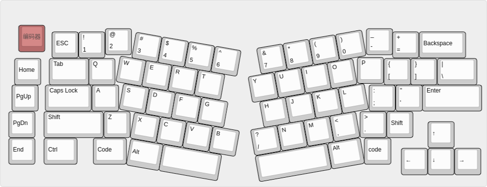

# ALICEGO 1.2版本固件

## 基本功能
- 按Fn+Tab切换设备。
- Fn+CapsLock休眠(任意按键唤醒)。
- 编码器旋钮下压1-4秒关机(接通USB唤醒，此时按键无法唤醒)，5-9秒启动DFU，10秒以上重置。
- OLED屏幕:分辨率128*32
显示NumLock、CapsLock、 蓝牙连接状态、电池电量、usb状态。
- 按键阵列Row：5, 6, 7, 8, 9, 11, 12, 13, 14, 15
- 按键阵列Col：23, 20, 19, 22, 18, 17, 16

## 配列（68键）

