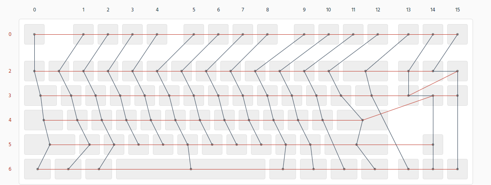

# LKB-Core 测试固件

测试用的固件。不带休眠和指示灯功能，仅用于测试。

按Fn+Tab切换设备，Fn+CapsLock休眠。

- 按键阵列Row：9, 8, 7, 6, 5, 4
- 按键阵列Col：3, 11, 12, 13, 14, 15, 16, 17, 18, 19, 20, 30, 29, 28, 25, 24
- NumLock：22
- CapsLock: 23
- Bootloader: 10